# Infra5 AI Development Framework - Project Structure

This document provides the complete technology stack and file tree structure for the Infra5 AI Development Framework Integration project. **AI agents MUST read this file to understand the project organization before making any changes.**

## Technology Stack

### AI Development Framework
- **Claude Code v1.5.5+** - Primary AI development assistant with MCP server support
- **Resonance TDD Framework** - Test-driven development workflow with checkpoint system
- **Context7 MCP** - Live documentation fetching for external libraries

### Development Automation
- **Bash 5.0+** - Shell scripting for hooks and automation
- **JSON** - Configuration and checkpoint data storage
- **Markdown** - Documentation and command templates
- **Git** - Version control with worktree support for isolated development

### Integration Services & APIs
- **Linear MCP Server** - Issue tracking and project management integration
- **Gemini MCP Server** - Deep AI consultation and problem-solving sessions
- **GitHub API** - Repository management and pull request automation

### Security & Privacy
- **MCP Security Scanner** - Automated secret detection and prevention
- **Pattern-based Detection** - Configurable sensitive data patterns
- **Whitelist System** - Allowed placeholder patterns for examples

### Development & Quality Tools
- **Shell Script Testing** - Command validation and integration testing
- **JSON Schema Validation** - Configuration and checkpoint structure validation
- **Markdown Linting** - Documentation quality maintenance
- **Git Hooks** - Pre-commit validation and quality gates

### Multi-Agent Orchestration
- **Task Tool** - Parallel sub-agent execution for complex operations
- **Context Injection** - Automatic documentation loading for agents
- **Strategy Selection** - Adaptive complexity-based agent deployment

### Future Technologies (from Linear Issues)
- **Linear Workflow Automation** (DAV-156) - Auto-update issues based on system state
- **CCDK Multi-Agent Workflows** (DAV-157) - Enhanced agent collaboration patterns
- **CodeRabbit AI** (DAV-161) - Automated code review and feedback cycle
- **Husky Pre-commit** (DAV-162) - Enhanced pre-commit validation
- **Claude Hooks Library** (DAV-163) - Extended hook capabilities

## Complete Project Structure

```
Infra5/
├── README.md                           # Project overview (placeholder)
├── CLAUDE.md                           # Master AI context file with development principles
├── MCP-ASSISTANT-RULES.md              # Rules for MCP assistant behavior
├── package.json                        # Node.js package configuration
├── .gitignore                          # Git ignore patterns
├── .claude/                            # Claude Code AI Framework configuration
│   ├── CONTEXT.md                      # Framework documentation (Tier 2)
│   ├── settings.local.json             # Claude Code local configuration
│   ├── commands/                       # Multi-agent orchestration templates
│   │   ├── README.md                   # Command system overview
│   │   ├── code-review.md              # Multi-agent code quality analysis
│   │   ├── create-docs.md              # Intelligent documentation generation
│   │   ├── full-context.md             # Adaptive context gathering
│   │   ├── gemini-consult.md           # Deep AI consultation sessions
│   │   ├── handoff.md                  # Session continuity management
│   │   ├── refactor.md                 # Intelligent code restructuring
│   │   └── update-docs.md              # Documentation synchronization
│   └── hooks/                          # Automated lifecycle behaviors
│       ├── README.md                   # Hooks system overview
│       ├── config/                     # Hook configuration
│       │   └── sensitive-patterns.json # Security pattern definitions
│       ├── setup/                      # Installation templates
│       │   ├── hook-setup.md           # Hook installation guide
│       │   └── settings.json.template  # Settings template
│       ├── sounds/                     # Audio notification files
│       │   ├── complete.wav            # Task completion sound
│       │   └── input-needed.wav        # User attention sound
│       ├── gemini-context-injector.sh  # Auto-attach project docs to Gemini
│       ├── mcp-security-scan.sh        # Prevent secret exposure
│       ├── notify.sh                   # Audio notifications
│       └── subagent-context-injector.sh # Ensure agent context consistency
├── cycles/                             # Resonance TDD session management
│   ├── CONTEXT.md                      # Cycles documentation (Tier 2)
│   └── YYYY-MM-DD/                     # Date-organized session artifacts
│       ├── HHMM-topic-plan.md          # Planning documents with expectations
│       ├── HHMM-topic-checkpoint.json  # Implementation checkpoints
│       └── HHMM-implementation-summary.md # Completion summaries
├── tests/                              # Framework validation tests
│   ├── CONTEXT.md                      # Testing documentation (Tier 2)
│   ├── test-cycle-plan-simple.sh       # Basic context awareness tests
│   ├── test-cycle-plan-context.sh      # Comprehensive validation
│   └── test-cycle-plan-final-validation.sh # Production readiness
├── docs/                               # Documentation root
│   ├── README.md                       # Documentation overview
│   ├── ai-context/                     # AI-specific documentation (Tier 1)
│   │   ├── project-structure.md        # This file - project organization
│   │   ├── docs-overview.md            # 3-tier documentation architecture
│   │   ├── system-integration.md       # Cross-component patterns
│   │   ├── deployment-infrastructure.md # Infrastructure patterns
│   │   └── handoff.md                  # Session continuity
│   ├── open-issues/                    # Active problem tracking
│   │   └── example-api-performance-issue.md # Issue template
│   ├── specs/                          # Feature specifications
│   │   ├── example-api-integration-spec.md # API spec template
│   │   └── example-feature-specification.md # Feature spec template
│   ├── CONTEXT-tier2-component.md      # Tier 2 documentation template
│   └── CONTEXT-tier3-feature.md        # Tier 3 documentation template
├── logs/                               # Application and hook logs
└── [PLACEHOLDER-DIRS]/                 # Future component directories
    ├── backend/                        # Backend implementation (planned)
    ├── frontend/                       # Frontend implementation (planned)
    ├── infrastructure/                 # IaC implementation (planned)
    └── .taskmaster/                    # Task Master data (when initialized)
```

## Complete Development Workflow Architecture Plan

```mermaid
graph TD
    A["User Request (e.g., 'Build feature X')"] --> B_PLAN;

    subgraph "Step 1: Planning Phase"
        direction LR
        B_PLAN("User runs <b>/cycle-plan</b>") --> C_PLAN[Orchestrator Analyzes Request];
        C_PLAN --> D_PLAN{Context Loaded};
        D_PLAN -- "Tier 1-3 Docs<br/>(DAV-151)" --> E_PLAN[AI Collaborates on Plan];
        E_PLAN --> F_PLAN[("plan.md<br/>+<br/>Expectation Checklist")];
    end

    F_PLAN --> G_START;

    subgraph "Step 2: Implementation Setup"
        direction LR
        G_START("User runs <b>/cycle-start &lt;issue-id&gt;</b>") --> H_START["git-workflow.sh<br/>(DAV-176)"];
        H_START -- Fetches Branch Name --> Linear;
        H_START -- "Creates Branch<br/>+ Worktree (DAV-154)" --> Git;
        H_START -- Status: In Progress --> Linear;
        H_START --> I_START["Checkpoint Manager<br/>Creates Initial Checkpoint<br/>(DAV-152)"];
        I_START --> J_START[("checkpoint.json<br/>(Context + Git Metadata)")];
    end

    J_START --> K_DEV;

    subgraph "Step 3: Development Loop (TDD)"
        K_DEV("AI Implements Code in<br/>Red-Green-Refactor Cycle") --> L_DEV{On File Write};
        L_DEV -- Triggers --> M_DEV["Context7 Hook (DAV-10)<br/>Security Scan Hook<br/>Token Usage Monitor (DAV-175)"];
        K_DEV --> N_DEV{On Commit};
        N_DEV -- Triggers --> O_DEV["Husky Pre-commit<br/>Checks (DAV-162)"];
        K_DEV --> P_LOG("User runs <b>/cycle-log</b>");
        P_LOG --> Q_LOG["Checkpoint Updated<br/>Reality Checklist Populated<br/>Evidence Captured (DAV-153)"];
        Q_LOG --> R_LOG["<b>Automated Doc Updates (DAV-169)</b><br/>Learnings from Reality Checklist<br/>are written back to Tier 1-3 Docs"];
        R_LOG --> K_DEV;
    end

    K_DEV --> S_CHECK;

    subgraph "Step 4: Quality Gates with Multi-Agent Validation Loop"
        S_CHECK("User runs <b>/cycle-check</b>") --> T_CHECK["ValidationExecutor Runs<br/>(DAV-173)"];
        T_CHECK --> T1_AGENTS["Multi-Agent Validation<br/>(DAV-155, DAV-157)"];
        T1_AGENTS --> T2_ANALYSIS{All Agents<br/>Pass?};
        T2_ANALYSIS -- No --> T3_FEEDBACK["Agent Feedback<br/>Aggregated"];
        T3_FEEDBACK --> T4_PLAN["AI Plans Fixes<br/>Based on Feedback"];
        T4_PLAN --> T5_IMPLEMENT["Auto-trigger<br/>Fix Implementation"];
        T5_IMPLEMENT --> T_CHECK;
        T2_ANALYSIS -- Yes --> U_CHECK[("Validation Report<br/>+<br/>TDD Evidence (DAV-153)")];
        U_CHECK --> V_CHECK{Checkpoint Milestone<br/>Detected?};
        V_CHECK -- Yes --> W_CHECK["<b>Human Verification Required (DAV-174)</b><br/>Workflow Pauses for User Approval"];
        W_CHECK --> X_CHECK{Approved?};
        X_CHECK -- Yes --> Y_COMPLETE;
        X_CHECK -- No --> T4_PLAN;
        V_CHECK -- No --> Y_COMPLETE;
    end

    Y_COMPLETE --> Z_COMPLETE;

    subgraph "Step 5: Finalization & PR Creation"
        direction LR
        Z_COMPLETE("User runs <b>/cycle-complete</b>") --> AA_COMPLETE["git-workflow.sh<br/>(DAV-176)"];
        AA_COMPLETE -- Status: In Review --> Linear;
        AA_COMPLETE --> BB_COMPLETE[Final Checkpoint Saved];
        BB_COMPLETE --> CC_COMPLETE[("Pull Request Created")];
    end

    CC_COMPLETE --> DD_REVIEW;

    subgraph "Step 6: CodeRabbit Review Loop (DAV-161)"
        DD_REVIEW["CodeRabbit AI<br/>Reviews PR"] --> EE_REVIEW{Issues Found?};
        EE_REVIEW -- No --> FF_MERGE[("Ready to Merge")];
        EE_REVIEW -- Yes --> GG_REVIEW["CodeRabbit Comments<br/>Saved as Review Checkpoint"];
        GG_REVIEW --> HH_REVIEW["<b>Auto-trigger cycle-check</b><br/>to Plan Fixes"];
        HH_REVIEW --> II_REVIEW["AI Analyzes Comments<br/>Creates Fix Plan"];
        II_REVIEW --> JJ_REVIEW{Human Verification<br/>Required?};
        JJ_REVIEW -- "Yes (per feature config)" --> KK_REVIEW["Human Reviews<br/>Fix Plan"];
        KK_REVIEW --> LL_REVIEW{Approved?};
        LL_REVIEW -- No --> II_REVIEW;
        LL_REVIEW -- Yes --> MM_REVIEW;
        JJ_REVIEW -- "No (auto-fix allowed)" --> MM_REVIEW;
        MM_REVIEW["<b>Auto-trigger cycle-start</b><br/>Implements Fixes"] --> NN_REVIEW["Code Changes<br/>Applied to PR"];
        NN_REVIEW --> OO_REVIEW["<b>Auto-trigger cycle-check</b><br/>Validates Fixes"];
        OO_REVIEW --> PP_REVIEW["Updated PR<br/>Pushed to Git"];
        PP_REVIEW --> DD_REVIEW;
    end

    %% External Systems
    Linear["Linear MCP<br/>(DAV-161 alignment)"];
    Git["Git Repository"];
    CodeRabbit["CodeRabbit AI"];

    %% Additional Components
    subgraph "Context Management (DAV-170)"
        CM1["Dynamic Token Limiter"];
        CM2["Context Injector Hook"];
    end

    %% Style Definitions
    classDef plain fill:#FFF,stroke:#333,stroke-width:2px
    classDef command fill:#89CFF0,stroke:#333,stroke-width:2px
    classDef process fill:#F2B279,stroke:#333,stroke-width:2px
    classDef artifact fill:#F9E79F,stroke:#333,stroke-width:2px
    classDef feedbackLoop fill:#B3E575,stroke:#333,stroke-width:2px
    classDef qualityGate fill:#E57575,stroke:#333,stroke-width:2px
    classDef reviewLoop fill:#DDA0DD,stroke:#333,stroke-width:2px
    classDef agentLoop fill:#FFB6C1,stroke:#333,stroke-width:2px

    class A,K_DEV,Linear,Git,CodeRabbit plain
    class B_PLAN,G_START,P_LOG,S_CHECK,Z_COMPLETE command
    class C_PLAN,E_PLAN,H_START,I_START,Q_LOG,T_CHECK,V_CHECK,X_CHECK,AA_COMPLETE,BB_COMPLETE process
    class F_PLAN,J_START,U_CHECK,CC_COMPLETE,GG_REVIEW artifact
    class R_LOG feedbackLoop
    class W_CHECK,KK_REVIEW qualityGate
    class DD_REVIEW,HH_REVIEW,MM_REVIEW,OO_REVIEW reviewLoop
    class T1_AGENTS,T3_FEEDBACK,T4_PLAN,T5_IMPLEMENT agentLoop
```




## Key Architectural Patterns

### Multi-Agent Orchestration
The system uses parallel agent execution for complex tasks, with specialized agents for:
- Code analysis and review
- Documentation generation
- Security validation
- Context gathering

### Security-First Design
- Automated secret detection before MCP calls
- Configurable sensitive pattern matching
- Whitelist system for safe placeholders
- Comprehensive audit logging

### Context Management
- 3-tier documentation system for efficient AI loading
- Automatic context injection for all agents
- Session persistence through checkpoints
- Smart documentation updates

### Evidence-Based Development
- TDD workflow with checkpoint tracking
- Reality vs expectation validation
- Comprehensive metrics collection
- Pattern extraction for continuous improvement

## Integration Points

### MCP Server Integrations
- **Task Master**: Project and task management
- **Context7**: Live documentation for libraries
- **Linear**: Issue tracking and workflow
- **Gemini**: Deep AI consultation

### Hook Integration Points
- **PreToolUse**: Security scanning, context injection
- **Notification**: User attention management
- **Stop**: Task completion feedback

### Command Integration
- Commands auto-load project context
- Parallel agent execution for efficiency
- Smart strategy selection based on complexity
- Integrated documentation updates

---

*This project structure represents the current state of the Infra5 AI Development Framework. As components are implemented, placeholder directories will be replaced with actual implementations following the established patterns.*